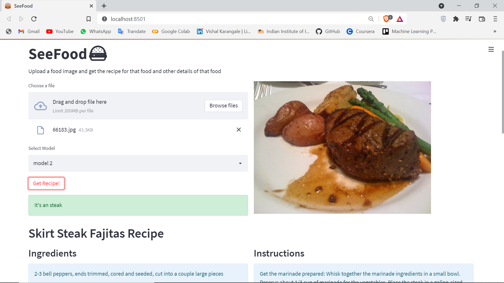
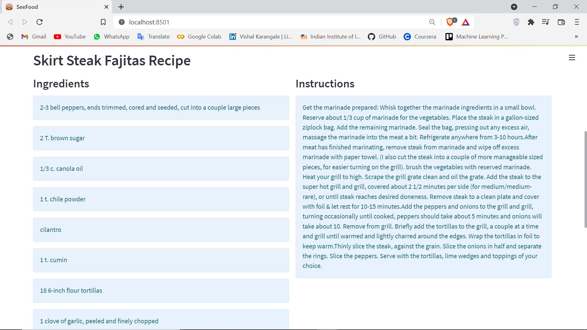
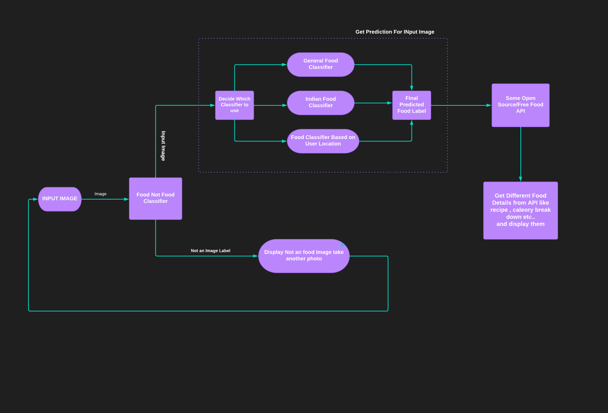

# SeeFood
an web App to classify food dishes and then to disply recipe of that food

Try Demo: **[Web App](https://huggingface.co/spaces/Vrk/SeeFood)**

<p float="left">
  
   
</p>

# Project Flow Chart

</img>

# SeeFood Flask API Responce
```
{
    "foodName": "hamburger",
    "status": 200,
    "foodDetails": {
        "id": 642539,
        "ingridents": [
            "chickpeas, drained and rinsed",
            "tahini",
            "sriracha sauce",
            "garlic",
            "fresh parsley, roughly chopped",
            "red onion, diced",
            "peanut oil",
            "cucumber",
            "tomato",
            "hamburger buns (I used President's Choice multi-grain thins)",
            "Tzatziki for topping"
        ],
        "instructions": "Pat the chickpeas dry with a paper towel and throw them into a food processor along with the garlic.\nPuree until smooth.\nUsing your clean hands incorporate tahini, sriracha, parsley and onion into the chickpea mixture.\nForm mixture into four patties and set aside.\nHeat peanut oil in a large skillet over medium heat.\nOnce the oil begins to shimmer add the patties and cook for three minutes per side or until golden brown.\nRemove from and place in a hamburger bun.\nTop each burger with 2 slices of tomato, 2 slices of cucumber and a dollop of tzatziki.\nServe immediately.",
        "percentCarbs": 41.95,
        "percentFat": 46.97,
        "percentProtein": 11.08,
        "readyTime": 45,
        "soureUrl": "https://www.foodista.com/recipe/DYNQRHMK/falafel-burger",
        "summary": "You can never have too many middl eastern recipes, so give Falafel Burger a try. For $1.37 per serving, this recipe covers 19% of your daily requirements of vitamins and minerals. One portion of this dish contains around 12g of protein, 20g of fat, and a total of 402 calories. This recipe serves 4. It is brought to you by Foodista. 4 people were impressed by this recipe. Head to the store and pick up onion, garlic, sriracha sauce, and a few other things to make it today. Only a few people really liked this main course. From preparation to the plate, this recipe takes about about 45 minutes. It is a good option if you're following a dairy free and lacto ovo vegetarian diet. With a spoonacular score of 81%, this dish is spectacular. Try <a href=\"https://spoonacular.com/recipes/clean-eating-falafel-burger-1063020\">Clean eating falafel burger</a>, <a href=\"https://spoonacular.com/recipes/clean-eating-falafel-burger-848720\">Clean eating falafel burger</a>, and <a href=\"https://spoonacular.com/recipes/falafel-veggie-burger-with-feta-yogurt-sauce-559036\">Falafel Veggie Burger with Feta Yogurt Sauce</a> for similar recipes.",
        "title": "Falafel Burger"
    }
}
```
<!-- - **[Nutrition API](https://rapidapi.com/spoonacular/api/recipe-food-nutrition)** is used to get all the information of food -->


# Datasets Used

- **[FOOD 101](https://www.kaggle.com/dansbecker/food-101)** for general food Model
- for **Indian Food Data** created my own dataset


# Classification Models

| Classifier          | Accuracy |
|---------------------|------|
| EfficientNEt-B0 | 0.69 |
| Xception | 0.76 |
| Rexnet 200 | 0.75|
| ViT | **0.85** |

## ViT ( Vision Transformer )

</img>

## Contact Me

<p align="start">
    <a href="https://github.com/vishalrk1" target="_blank">
        &nbsp;
    </a>
    <a href="https://www.linkedin.com/in/vishal-karangale-126492216/" target="_blank">
        &nbsp;
    </a>
     <a href="https://www.instagram.com/vishal_rk1/" target="_blank">
       &nbsp;
    </a>
</p>
